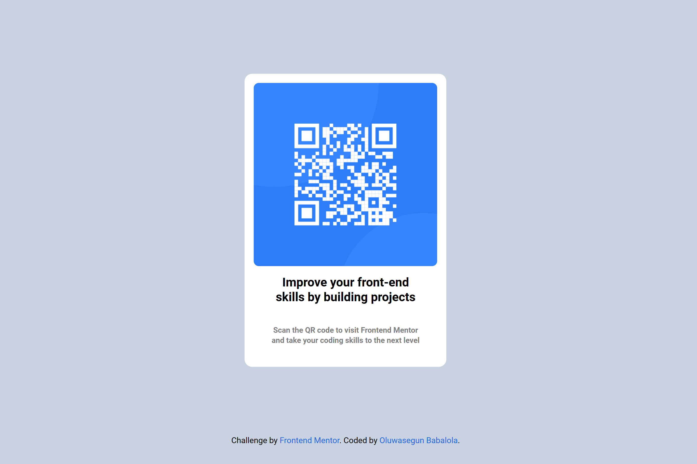
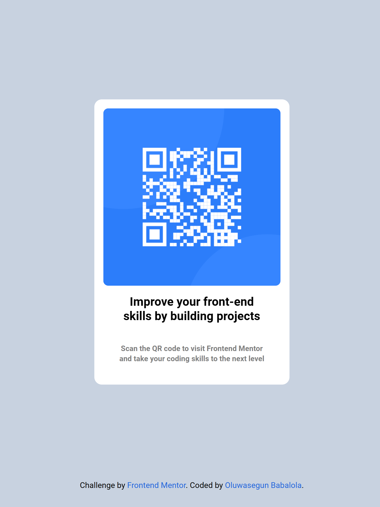

# Frontend Mentor - QR code component solution

This is a solution to the [QR code component challenge on Frontend Mentor](https://www.frontendmentor.io/challenges/qr-code-component-iux_sIO_H). Frontend Mentor challenges help you improve your coding skills by building realistic projects. 

## Table of contents

- [Overview](#overview)
  - [Screenshot](#screenshot)
  - [Links](#links)
- [My process](#my-process)
  - [Built with](#built-with)
  - [What I learned](#what-i-learned)
- [Author](#author)

## Overview

### Screenshot
 Destop view on a Surface pro 7
  
 Tablet view on an ipad mini
   
 Mobile (protrait orientation)view on an Iphone 14 pro max
   
 
 Links

- Solution URL: [Add solution URL here](https://your-solution-url.com)
- Live Site URL: [Add live site URL here](https://your-live-site-url.com)

## My process

### Built with

- Semantic HTML5 markup
- CSS custom properties
- CSS Grid


### What I learned
I learnt how to pseudoclass and pseudo-elments in a new way.

Code snippets on pseudoclass and pseudo-elments , see below:

```css
    h1{

        display: grid;
        grid-template-columns: 1fr;
        grid-template-rows: 1fr 1fr;
        gap: 10px;
    }

    h1:first-child{
        font-size: 20px;
        line-height: 25px;
    }

    h1::after{
        content: " Scan the QR code to visit Frontend Mentor and take your coding skills to the next level";
        font-size: 14px;
        color: gray;
    }
```


## Author
- Frontend Mentor - [@Officialbabs](https://www.frontendmentor.io/profile/Officialbabs)
- Twitter - [@officialbabs_01](https://www.twitter.com/officialbabs_01)

